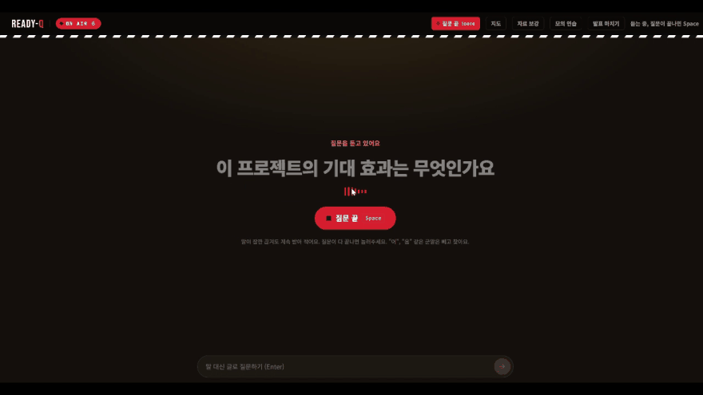

# Ready-Q

발표 질의응답 프롬프터. 
발표자료와 보강 자료를 미리 읽어두었다가, 청중 질문이 들어오면 근거 슬라이드와 말할 순서, 추천 답변을 발표자 화면에 띄운다.

**26-2 명지대학교 AI(클로드 코드) 기반 VIBE CODING 실전활용 경진대회 우수상**

VibeByeBug 팀 — 조은비(PM, QA), 민서정(백엔드), 박서연(프론트엔드), 이예진(AI)

| | |
|---|---|
| 데모 | https://vibebyebug-vibebyebug.vercel.app |
| 백엔드 | https://readyq-167847179810.asia-northeast3.run.app |



질문을 듣고 추천 답변과 말할 순서를 띄우는 장면이다. 근거 슬라이드와 응답 시간이 함께 표시된다.

※ 데모는 크롬에서 열어야 음성 인식이 동작한다. 발표자료를 올리지 않아도 목록에 있는 자료로 바로 써 볼 수 있다. 
※ 백엔드가 잠들어 있으면 자료 준비에 1분 남짓 걸린다.

## 무슨 프로젝트?

발표 전, 중, 후의 세 구간에서 도움을 주는 프로젝트이다.

| 구간 | 하는 일 |
|---|---|
| 발표 전 | 자료를 읽고 예상 질문을 만든다. 답변에서 빠뜨린 근거를 알려준다 |
| 발표 중 | 질문을 듣고 근거 슬라이드와 키워드를 428ms 안에, 추천 답변을 1.4초에 띄운다 |
| 발표 후 | 받은 질문과 판정 결과로 회고 리포트를 만든다 |

※ 자료에 근거가 없으면 지어내지 않고, 추론한 답은 추론이라고 표시하고, 자료와 무관한 질문은 답을 만들지 않는다.

## 측정 결과

기술 선택을 전부 측정으로 했다. 자세한 기록은 [ai/README.md](ai/README.md) 에 있다.

**검색** — 문서 289장, 손으로 쓴 질문 45개, 질문을 하나씩 넣어 측정

| 검색기 | R@3 | p50 | p95 | 색인 |
|---|---|---|---|---|
| BM25 + BGE-M3 | 93.3% | 584ms | 2,215ms | 721초 |
| **BM25 + e5-small** | **88.9%** | **169ms** | **428ms** | **62초** |
| BGE-M3 단독 | 84.4% | 421ms | 608ms | 515초 |
| BM25 단독 | 80.0% | 0.7ms | 1.2ms | 0초 |
| e5-small 단독 | 75.6% | 93ms | 206ms | 122초 |

정확도 4.4%p 를 버리고 p95 를 5분의 1, 색인을 12분에서 1분으로 줄였다.
평균이 아니라 p95 로 예산을 잡았다.

**단일 검색기의 한계** — 문서를 18장에서 289장으로 늘리자 단일 방식은 전부 떨어졌다.

| 검색기 | 18장 | 289장 | 변화 |
|---|---|---|---|
| 결합 | 93.3% | 93.3% | 0 |
| KURE-v1 | 95.6% | 88.9% | -6.7 |
| BGE-M3 | 91.1% | 84.4% | -6.7 |
| BM25 | 88.9% | 80.0% | -8.9 |

**그 외**

- 질문 유형 분류: 키워드 규칙 93.3%, 임베딩 42.2%, 최다 유형 찍기 46.7%
- 근거 없음 판정: 관련 질문 100% 통과, 무관한 질문 90% 차단, 잡음 10/10 차단
- 판정 문턱값 0.26 — 0.02~0.50 구간이 같은 성능이라 구간 한가운데를 골랐다
- 보강 자료 효과: 설명 자료에만 답이 있는 질문의 정답률 0% → 64%


## 구성

| | |
|---|---|
| 프론트엔드 | React, TypeScript, Vite, Tailwind CSS |
| 백엔드 | Python, FastAPI, Uvicorn, WebSocket |
| 검색 | BM25 + multilingual-e5-small 하이브리드, kiwipiepy |
| 답변 생성 | OpenAI gpt-5.4-mini, 이미지 슬라이드 인식 gpt-4o |
| 음성 인식 | 브라우저 Web Speech API (Chrome) |
| 배포 | Vercel (화면), Google Cloud Run (백엔드) |

실시간으로 근거를 찾는 구간은 모델을 부르지 않는다. 임베딩도 서버에서 직접 돌린다.
모델 호출은 추천 답변과 말할 순서를 만들 때 질문당 두 번이다.

## 실제 시연 해보기

설치가 막히거나 업로드가 안 될 때 확인할 것은 [SETUP.md](SETUP.md) 에 있다.

```bash
pip install -r requirements.txt      # 백엔드
python -m uvicorn main:app --port 8000

npm install                          # 프론트엔드 (다른 터미널)
npm run dev
```

`ai/.env` 에 API 키를 넣어야 추천 답변과 예상 질문이 만들어진다. 
키가 없어도 서버는 뜨고 글자가 있는 PDF 의 업로드와 근거 검색까지는 동작한다.
설치가 제대로 됐는지는 `curl http://localhost:8000/api/health` 로 확인할 수 있다.

## 문서

- [ai/README.md](ai/README.md) — AI 모듈의 설계 결정과 측정 기록 전부
- [SETUP.md](SETUP.md) — 설치와 문제 해결
- [DEPLOY_CLOUDRUN.md](DEPLOY_CLOUDRUN.md) — Cloud Run 배포 절차와 설정값의 이유
